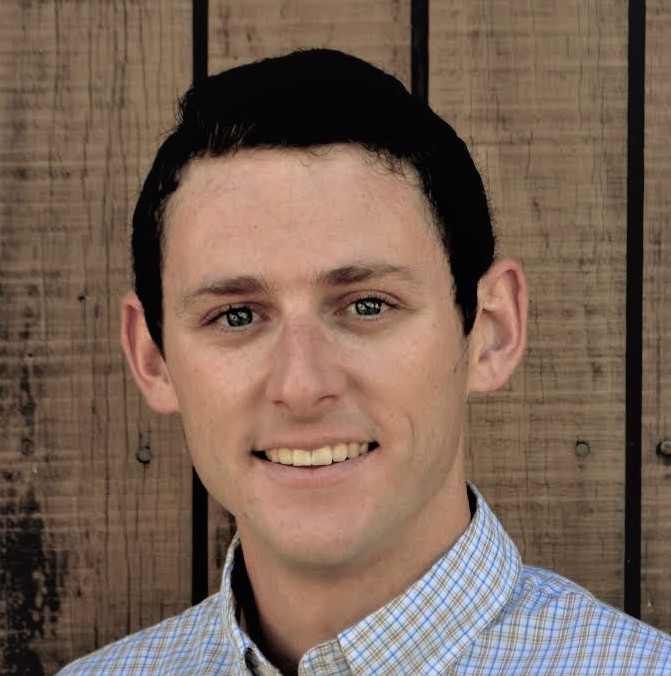

<link rel="stylesheet" href="{{ site.baseurl | prepend: site.url }}/custom.css">

    <!-- 

        <h1>Timeline</h1>
    
 -->

    

        

        

            
 

            

            

                <h1> developmental science seminar</h1>
                 
                 
                
Date: Monday, July 11

                
Time: 10AM-11:30AM PDT
                
                
Zoom info: <a href="https://ucsd.zoom.us/meeting/register/tJEtde-oqj4sH9F5LwqVqk_BE0seb7dCTJvc" style="position:relative; display:block"><strong>Register</strong></a>

                

                

                <h2>speakers</h2>
                <a href="https://as.nyu.edu/content/nyu-as/as/faculty/Moira-Dillon.html" style="position:relative; display:block">Moira Dillon<strong> (Chair)</strong> </a>
                NYU
                 
                
                 
                 <a href="https://www.brialong.com/"  style="position:relative; display:block">Bria Long <strong> (Speaker) </strong></a> Stanford University
                
                  
                <a href="https://people.coe.uga.edu/logan-fiorella/" style="position:relative; display:block">Logan Fiorella<strong> (Speaker)</strong> </a>  University of Georgia
                
                

            

        

        

            
 

            

                

                <h1>artificial intelligence seminar</h1>
                 
                 
                
Date: Tuesday, July 12

                
Time: 7:30AM-9AM PDT

                
Zoom info: <a href="https://ucsd.zoom.us/meeting/register/tJAsce6grz0tGdHar9l3hoiXlCZB7o7Pymoa" style="position:relative; display:block"><strong>Register</strong></a>

                

                

                <h2>speakers</h2>

                <a href="https://research.google/people/105004/" style="position:relative; display:block">David Ha <strong> (Chair)</strong> </a>
                Google
                 
                

                 

                 <a href="https://yulia.gryaditskaya.com/" style="position:relative; display:block">Yulia Gryaditskaya <strong> (Speaker) </strong> </a>
                 University of Surrey
                

                  

                <a href="https://web.mit.edu/zyzzyva/www/academic.html" style="position:relative; display:block">Cathy Wong<strong> (Speaker)</strong></a>
                MIT
                 
                

                

                  
                  

            

        

        

            
 

            

             

                <h1>neuroscience seminar</h1>
                 
                 
                
Date: Wednesday, July 13

                
Time: 12PM-1:30PM PDT

                
Zoom info: <a href="https://ucsd.zoom.us/meeting/register/tJAudO2gpj8sH9aAMGh5Za_tIVmMSVS_oleK" style="position:relative; display:block"><strong>Register</strong></a>

                

                

                <h2>speakers</h2>

                <a href="https://brainbridgelab.uchicago.edu/people/" style="position:relative; display:block">Wilma Bainbridge<strong> (Chair)</strong></a>
                University of Chicago
                

                 

                 <a href="https://www.thelamplab.ca/lab-members"  style="position:relative; display:block">Jeffrey Wammes<strong> (Speaker)</strong></a>
                Queen's University
                

                  

                <a href="http://www.mrc-cbu.cam.ac.uk/people/Matt.Lambon-Ralph/" style="position:relative; display:block">Matt Lambon-Ralph<strong> (Speaker)</strong></a>
                University of Cambridge
                

                

            

        

     

            
 

            

            <h2> CogSci 2022</h2>
            
Date: July 27th, 08:30 – 16:30 EDT

            
Toronto, Canada

                

            

        

    

<script src="{{ site.baseurl | prepend: site.url }}/timeline.js">
